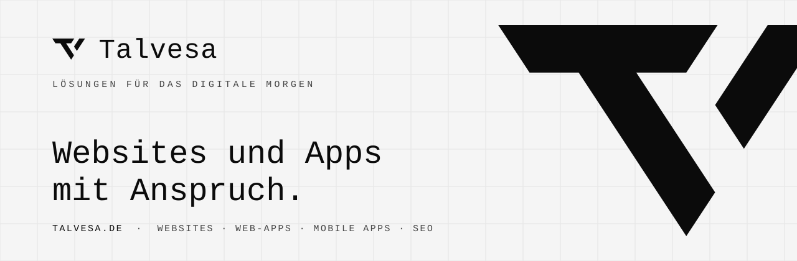

<p align="center">
  <a href="https://talvesa.de">
    <picture>
      <source media="(prefers-color-scheme: dark)" srcset="./assets/banner-dark.svg">
      <source media="(prefers-color-scheme: light)" srcset="./assets/banner-light.svg">
      
    </picture>
  </a>
</p>

<p align="center">
  <a href="https://talvesa.de"><b>talvesa.de</b></a>
  &nbsp;·&nbsp;
  <a href="https://talvesa.de/leistungen/">Leistungen</a>
  &nbsp;·&nbsp;
  <a href="https://talvesa.de/pakete/">Pakete</a>
  &nbsp;·&nbsp;
  <a href="https://talvesa.de/referenzen/">Referenzen</a>
  &nbsp;·&nbsp;
  <a href="https://talvesa.de/ratgeber/">Ratgeber</a>
  &nbsp;·&nbsp;
  <a href="https://talvesa.de/kontakt/">Kontakt</a>
</p>

<br>

**Talvesa** ist ein Softwarestudio aus Freiburg im Breisgau. Wir gestalten und
entwickeln Websites, Web-Apps und mobile Apps für kleine und mittelgroße
Unternehmen in ganz Deutschland — von der ersten Idee bis zum laufenden Betrieb,
mit einem festen Ansprechpartner und Hosting in Deutschland.

Zwei Entwickler, zusammen mehr als 15 Jahre Erfahrung. Keine Hotline, kein
Ticketsystem, kein Chatbot: Sie sprechen mit den Menschen, die Ihre Software
bauen.

<br>

## Was wir bauen

|  |  |
| :-- | :-- |
| **Websites & Komplettpakete** | Vom One-Pager bis zum umfangreichen Auftritt, inklusive Relaunch. Inhalte pflegen Sie selbst — oder wir übernehmen das. |
| **Web-Apps & Software** | Kundenportale, Buchungssysteme, Dashboards und interne Werkzeuge. Software, die sich nach Ihren Abläufen richtet. |
| **Mobile Apps** | iOS und Android, vom ersten Prototyp bis zur Veröffentlichung im Store. |
| **SEO & Sichtbarkeit** | Kurze Ladezeiten, saubere Technik und ein gepflegtes Google-Profil, damit man Sie findet. |

<br>

## Wie wir arbeiten

```
01  Gespräch     Sie erzählen, was Sie brauchen. Wir schicken ein festes Angebot.
02  Entwurf      Struktur, Texte und Gestaltung — gezeigt, bevor wir bauen.
03  Umsetzung    Sie sehen Zwischenstände und geben frei. Domain und SSL nebenbei.
04  Livegang     Online, für Suchmaschinen eingerichtet, danach betreut.
```

<br>

## Worauf wir bestehen

- **Daten bleiben im Land.** Hosting in deutschen Rechenzentren, Datenschutz
  sauber eingerichtet.
- **Keine Ressourcen von Dritten.** Schriften, Skripte und Styles liegen auf
  dem eigenen Server — kein CDN, kein Tracking, das niemand bestellt hat.
- **Barrierefreiheit wird geprüft, nicht behauptet.** Unsere öffentlichen Seiten
  laufen im CI durch axe-core gegen WCAG 2.2 AA, in hellem und
  dunklem Design.
- **Ladezeit ist eine Einstellung, keine Hoffnung.** Feste Budgets für Anfragen
  und Seitengewicht statt eines Scores, der mit der Tagesform schwankt.
- **Sicherheit wird an der Wirkung getestet.** CSP, Cookie-Flags und
  Zugriffsrechte prüfen wir an der echten Antwort des Servers, nicht an der
  Konfiguration.
- **Klare Konditionen.** Feste Preise, faire Laufzeiten, und die Domain gehört
  Ihnen.

<br>

## Werkzeuge

<p>
  
  
  
  
  
  
  
  
  
  
  
</p>

<br>

## Kontakt

Erzählen Sie uns von Ihrem Projekt. Es antwortet ein Mensch, meistens noch am
selben Tag — per E-Mail, Telefon oder Videocall, egal wo Ihr Unternehmen sitzt.

**[Projekt anfragen →](https://talvesa.de/kontakt/)**

|  |  |
| :-- | :-- |
| Neue Projekte | [projekte@talvesa.de](mailto:projekte@talvesa.de) |
| Bestehende Kunden | [support@talvesa.de](mailto:support@talvesa.de) |
| Allgemein | [info@talvesa.de](mailto:info@talvesa.de) |

<br>

<p align="center">
  <picture>
    <source media="(prefers-color-scheme: dark)" srcset="./assets/mark-dark.svg">
    <source media="(prefers-color-scheme: light)" srcset="./assets/mark-light.svg">
    
  </picture>
  <br>
  <sub>LÖSUNGEN FÜR DAS DIGITALE MORGEN</sub>
  <br>
  <sub><a href="https://talvesa.de/impressum/">Impressum</a> · <a href="https://talvesa.de/datenschutz/">Datenschutz</a></sub>
</p>
